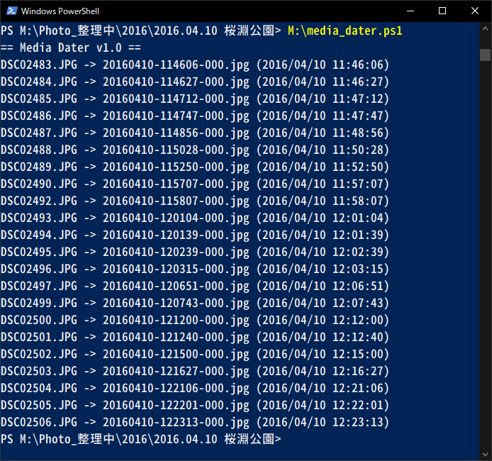
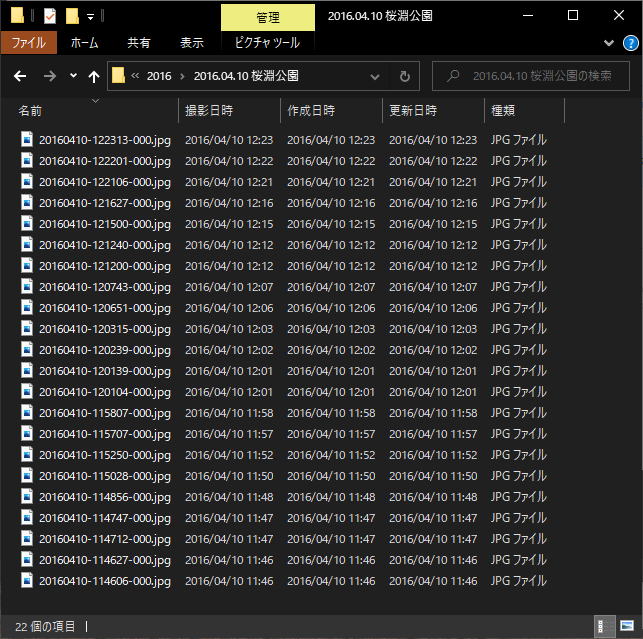

# Media Dater

メタデータ内の撮影日時情報をもとにファイルの名前/作成日時/更新日時を変更するPowerShellスクリプト

## 動作環境

Windows PowerShell 5.1

※あらかじめスクリプトの実行が許可されていること

1. 管理者権限でPowerShellを開く
2. 以下のコマンドを実行
    - Set-ExecutionPolicy RemoteSigned
    - Unblock-File media_dater.ps1
3. PowerShellを閉じる

## 対応ファイル

拡張子がjpg/mov/mp4の画像/動画ファイル

## 動作

1. 日付情報を取得する
   - jpgファイルはExifを参照
   - mov/mp4ファイルは詳細プロパティの「メディアの作成日時」を参照
   - 日付情報を取得できなかった場合はファイル名(YYYYMMDD-HHMMSS*)を参照
   - それでも取得できなかった場合はそのファイルはスキップする
2. ファイル名を変更する
   - YYYYMMDD-HHMMSS-3桁連番.元の拡張子 となる
3. ファイルの作成日時/更新日時を変更する
   - 撮影日時と同じとなる

## 使い方

1. media_dater.ps1 を適当な場所へ配置
2. 画像/動画ファイルが存在するフォルダ上でPowerShellを開く
3. media_dater.ps1 を実行する

## 参考

- https://neos21.hatenablog.com/entry/2019/11/11/080000
- https://qiita.com/Kosen-amai/items/52ec7e4e2f15f6a09bc3
- https://qiita.com/kmr_hryk/items/882b4851e23cec607e70

