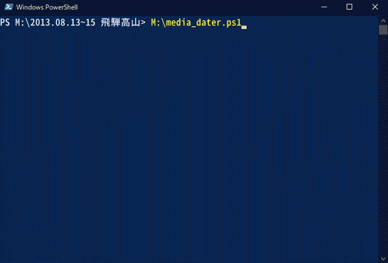
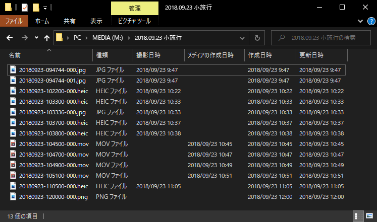

# Media Dater

メタデータ内の撮影日時情報をもとにファイルの名前/作成日時/更新日時を変更するPowerShellスクリプト

## 動作環境

Windows PowerShell 5.1

※あらかじめスクリプトの実行が許可されていること

1. 管理者権限でPowerShellを開く
2. 以下のコマンドを実行
    - Set-ExecutionPolicy RemoteSigned
    - Unblock-File media_dater.ps1
3. PowerShellを閉じる

## 対応ファイル

- 拡張子がjpg/png/heicの画像ファイル
- 拡張子がmov/mp4の動画ファイル

## 動作内容

1. 現在のフォルダの下にある全ファイルのリストを取得する
   - サブフォルダに含まれるファイルも対象
2. ファイル毎に日付情報を取得する
   - jpgファイルはExifを参照
   - heic/mov/mp4ファイルは詳細プロパティの「撮影日時」「メディアの作成日時」を参照  
       (両方設定されている場合は「撮影日時」を優先する)
   - 上記処理で日時情報を取得できなかったファイルやpngファイルはファイル名を参照  
     (YYYMMDD-HHMMSS\*.拡張子 の形式であれば日付と見なす)
   - それでも取得できなかった場合はそのファイルはスキップ
3. ファイル名を変更する
   - YYYYMMDD-HHMMSS-3桁連番.元の拡張子 とする
4. ファイルの作成日時/更新日時を変更する
   - 撮影日時と同じとする

## 使い方

1. media_dater.ps1 を適当な場所へ配置
2. PowerShellを開く
3. 画像/動画ファイルを含むフォルダへ移動
   - サブフォルダ下のファイルも対象となります
4. media_dater.ps1 を実行
   - "dry"オプションを指定すると変更内容の表示のみをおこないます(実際には変更しません)  
     \> .\media_dater.ps1 dry

## 参考

- https://neos21.hatenablog.com/entry/2019/11/11/080000
- https://qiita.com/Kosen-amai/items/52ec7e4e2f15f6a09bc3
- https://qiita.com/kmr_hryk/items/882b4851e23cec607e70

